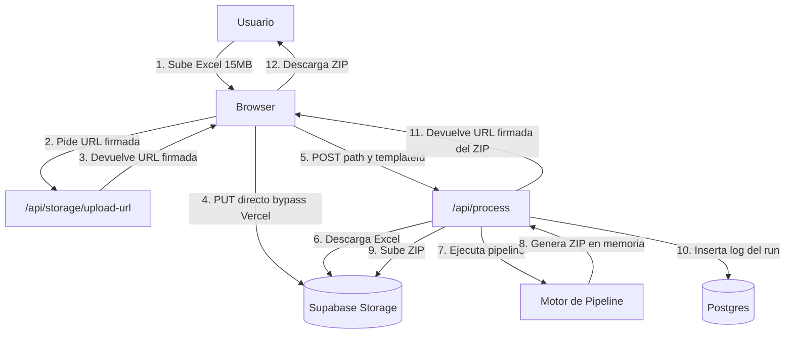
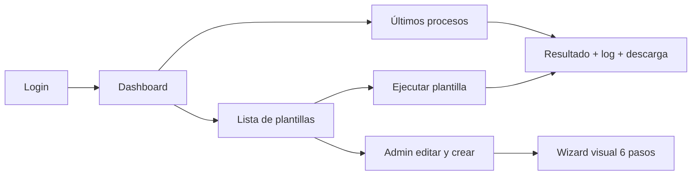

# Spec: App Generalista de Segmentación de Reportes

Fecha: 2026-04-20
Autor: Diseño colaborativo (brainstorming) con Joseph
Estado: Aprobado para implementación

## 1. Contexto y motivación

La aplicación actual (`Segmentador-de-Reportes-V2`) está construida en Streamlit con una página dedicada por tipo de reporte (`1_Reportes_Lima.py`, `2_Reportes_Provincia.py`, `3_Reportes_Lima_Corte_2.py`, `4_Reportes_Provincia_Corte_2.py`). Cada página duplica lógica de lectura, validación, normalización y segmentación. Cada vez que sale un formato nuevo de reporte hay que crear o modificar una página completa.

Además, Streamlit solo corre local y no está disponible para otros usuarios del equipo. Los reportes están evolucionando (ej. el nuevo Lima Corte 1 ahora tiene 3 hojas de reporte + una hoja detalle, cuando antes solo tenía una hoja de reporte + BASE).

Se quiere:

- Una sola aplicación web capaz de procesar cualquier tipo de reporte sin crear páginas por tipo.
- Autodetectar cabeceras en cualquier fila (no solo la primera).
- Soportar reportes con múltiples hojas que se consolidan (o que se validan cruzado).
- Mantener las validaciones actuales (detección de descuadres).
- Desplegable en web para el equipo, con autenticación.
- Resiliente a archivos grandes (~15 MB) evitando timeouts de Vercel.

## 2. Decisiones arquitectónicas

- **Stack**: Next.js 15 (App Router) + TypeScript + Tailwind + shadcn/ui. Procesamiento Excel con `exceljs` en Vercel Functions (runtime Node).
- **Backend as a service**: Supabase (Auth, Postgres, Storage).
- **Autenticación**: Supabase Auth con email + password o magic link.
- **Gestión de reportes**: plantillas declarativas guardadas en Postgres, editables desde una UI de admin con wizard visual.
- **Motor**: pipeline genérico de pasos declarativos en JSON. Cada plantilla es una lista de pasos que el engine interpreta.
- **Sin LLM**: no es necesario. Los reportes tienen estructura predecible y las operaciones son determinísticas (filtrar, agrupar, contar, sumar). Un LLM añadiría costo, latencia y riesgo de errores en cálculos de nómina.
- **Hosting**: Vercel (empezando en plan Hobby con optimizaciones de streaming/chunking; upgrade a Pro si archivos grandes lo requieren).
- **Ubicación del código**: nueva carpeta `webapp/` en la raíz del repo, aislada del proyecto Streamlit antiguo que queda como respaldo en la raíz.

### 2.1 Identidad visual

Colores institucionales (WIN Empresas):

- **Primario — Naranja Vibrante**: `#FF6B00`
- **Secundario — Ámbar / Oro**: `#FFB800`

Estos colores se configuran como tokens de Tailwind (`brand.primary` y `brand.secondary`) y se aplican a shadcn/ui mediante override de las variables CSS (`--primary`, `--secondary`, `--ring`) para que todo el sistema de componentes respete la identidad.

## 3. Arquitectura de alto nivel

### 3.1 Flujo de procesamiento

Para resolver el límite de 4.5 MB en request body de Vercel y el timeout corto, los archivos grandes nunca transitan por Vercel:



### 3.2 Módulos

- `app/(auth)/` — login/signup
- `app/(dashboard)/` — UI principal (lista de plantillas, ejecución, últimos procesos)
- `app/admin/templates/` — wizard de creación/edición de plantillas
- `app/api/storage/upload-url/` — URL firmada de subida
- `app/api/process/` — orquesta el procesamiento
- `app/api/runs/[id]/` — consulta estado y logs de un run
- `lib/pipeline/` — motor (interpretador de pasos)
- `lib/pipeline/steps/` — implementación de cada tipo de paso
- `lib/excel/` — helpers sobre `exceljs` (lectura con auto-detección, escritura con formatos)
- `lib/supabase/` — clientes server y browser

## 4. Modelo de datos

### 4.1 Schema de Postgres (Supabase)

```sql
create table report_templates (
  id uuid primary key default gen_random_uuid(),
  name text not null,
  description text,
  version int not null default 1,
  pipeline jsonb not null,
  sample_file_path text,
  created_by uuid references auth.users(id),
  created_at timestamptz default now(),
  updated_at timestamptz default now()
);

create table process_runs (
  id uuid primary key default gen_random_uuid(),
  template_id uuid references report_templates(id),
  template_version int not null,
  user_id uuid references auth.users(id),
  input_file_path text not null,
  input_file_name text not null,
  output_zip_path text,
  status text not null,
  summary jsonb,
  overrides jsonb,
  started_at timestamptz default now(),
  finished_at timestamptz,
  duration_ms int
);

create table process_run_logs (
  id bigserial primary key,
  run_id uuid references process_runs(id) on delete cascade,
  seq int not null,
  level text not null,
  message text not null,
  context jsonb
);

create index on process_runs (user_id, started_at desc);
create index on process_run_logs (run_id, seq);
```

RLS activado en las 3 tablas. `report_templates` es visible para todos los usuarios autenticados pero editable solo por admins (custom claim o tabla `user_roles`). `process_runs` y logs siguen la regla `user_id = auth.uid()`.

### 4.2 Estructura del pipeline (JSON en `report_templates.pipeline`)

Ejemplo para el nuevo Lima Corte 1 (multi-hoja):

```json
{
  "inputs": {
    "fileNamePattern": "Reportes AGENCIA LIMA Corte (?<corte>\\d+) (?<mes>\\w+) (?<anio>\\d{4})",
    "derivedVariables": [
      { "name": "PERIODO_COMI", "from": "fileName", "transform": "monthYearToYYYYMM" }
    ]
  },
  "steps": [
    {
      "id": "load_horizontal",
      "type": "load_sheet",
      "sheet": "Reporte CORTE 1 Horizontal",
      "headerDetection": { "strategy": "auto", "expectedColumns": ["RUC", "AGENCIA", "ALTAS"] }
    },
    { "id": "load_vertical",    "type": "load_sheet", "sheet": "Reporte CORTE 1 Vertical",    "headerDetection": { "strategy": "auto", "expectedColumns": ["RUC", "AGENCIA", "ALTAS"] } },
    { "id": "load_marcha",      "type": "load_sheet", "sheet": "Reporte CORTE 1 Marcha Blanca", "headerDetection": { "strategy": "auto", "expectedColumns": ["RUC", "AGENCIA", "ALTAS"] } },
    {
      "id": "load_base",
      "type": "load_sheet",
      "sheet": "BASE",
      "headerDetection": { "strategy": "auto", "expectedColumns": ["COD_PEDIDO", "TIPO_ESTADO", "CANAL", "PERIODO_COMI"] }
    },
    {
      "id": "filter_base",
      "type": "filter_rows",
      "source": "load_base",
      "filters": [
        { "column": "TIPO_ESTADO", "op": "in", "value": ["Validado", "Rescate"] },
        { "column": "CANAL", "op": "equals", "value": "Agencias" },
        { "column": "PERIODO_COMI", "op": "equals", "value": "$PERIODO_COMI" }
      ]
    },
    {
      "id": "split_by_agencia",
      "type": "split_by_column",
      "reportSources": ["load_horizontal", "load_vertical", "load_marcha"],
      "baseSource": "filter_base",
      "agencyColumn": { "report": "AGENCIA", "base": "ASESOR" },
      "normalize": { "upper": true, "trim": true, "removeChars": "." },
      "aliases": [
        { "canonical": "EXPORTEL SAC", "variants": ["EXPORTEL SAC", "EXPORTEL PROVINCIA"] }
      ]
    },
    {
      "id": "validate",
      "type": "validate",
      "rules": [
        {
          "name": "altas_vs_base",
          "left":  { "aggregate": "sum", "column": "ALTAS", "from": ["load_horizontal","load_vertical","load_marcha"], "scope": "per_agency" },
          "right": { "aggregate": "count", "column": "COD_PEDIDO", "from": "filter_base", "scope": "per_agency" },
          "onMismatch": "warn"
        }
      ]
    },
    {
      "id": "output",
      "type": "write_output",
      "perAgency": {
        "sheets": [
          { "name": "Reporte CORTE 1 Horizontal",   "from": "load_horizontal" },
          { "name": "Reporte CORTE 1 Vertical",     "from": "load_vertical" },
          { "name": "Reporte CORTE 1 Marcha Blanca", "from": "load_marcha" },
          { "name": "BASE",                          "from": "filter_base" }
        ],
        "fileNameTemplate": "Reporte {{agencyName}}.xlsx"
      },
      "zipFileNameTemplate": "Reportes_Lima_Corte_1_{{timestamp}}.zip"
    }
  ]
}
```

### 4.3 Catálogo de tipos de paso

- `load_sheet` — carga una hoja con auto-detección de cabecera (escanea primeras N filas buscando columnas esperadas). Soporta `strategy: auto | fixed_row | multi_level`.
- `filter_rows` — filtra filas por columna/operador: `equals`, `in`, `contains`, `between`, `gt`, `lt`, `not_null`.
- `split_by_column` — divide un dataset en grupos por columna (el caso de segmentar por agencia), con normalización y alias.
- `derive_column` — crea una columna nueva (ej: separar `AGENCIA PIURA` → `AGENCIA_BASE` + `DEPARTAMENTO`, o homologar departamento → zona NORTE/SUR con lookup table).
- `join` — une dos datasets por columna (casos futuros).
- `validate` — reglas cruzadas (sum = count, no nulos, formato). Resultado `warn` o `error`.
- `write_output` — genera los archivos por grupo y los empaca en ZIP, con formato de celdas configurable (colores, formato numérico, ancho de columnas).

### 4.4 Variables dinámicas

- `$PERIODO_COMI`, `$corte`, etc. se resuelven al inicio desde `inputs.fileNamePattern` (regex con grupos nombrados) o `inputs.derivedVariables` (transformaciones como `monthYearToYYYYMM`).
- El usuario puede sobreescribirlas en UI al ejecutar (Paso 2 de la pantalla de ejecución).

## 5. UX

### 5.1 Pantallas



### 5.2 Pantalla de ejecución (3 pasos)

1. **Subir archivo**: drag-and-drop del Excel. Barra de progreso subiendo directo a Storage.
2. **Confirmar variables dinámicas**: form con las variables extraídas del nombre del archivo. Usuario puede editar. Preview de hojas detectadas con check verde en las que la plantilla espera y warning si alguna falta.
3. **Procesar + resultado**: botón grande. Loading con logs en vivo (polling cada 2s a `/api/runs/{id}`). Al terminar: métricas (Total / Exitosas / Descuadres), tabla colapsable de log filtrable, botón de descarga del ZIP.

### 5.3 Wizard de admin (6 pasos)

1. **Información básica**: nombre, descripción, Excel de muestra obligatorio.
2. **Parseo del nombre de archivo**: editor de regex con chips sugeridos, vista previa en vivo de las variables extraídas.
3. **Hojas a usar**: checklist de hojas, etiqueta lógica por cada una, dropdown de estrategia de header, preview de primeras 10 filas con cabecera resaltada.
4. **Mapeo de columnas y filtros**: dropdowns por columna clave, editor tipo WHERE para filtros, editor de derivaciones.
5. **Segmentación y validaciones**: columna de segmentación, normalización con preview, editor de alias, editor de reglas de validación.
6. **Formato de salida**: hojas a incluir por grupo, plantilla de nombre de archivo, plantilla del ZIP, formatos visuales opcionales.

Al final: **dry-run** contra el Excel de muestra. Si OK, se guarda la plantilla.

### 5.4 Últimos procesos (historial ligero)

Lista de los 10-20 runs más recientes del usuario. Muestra: fecha, plantilla, archivo, estado, métricas resumen, botón de descarga del ZIP (si aún no expiró). TTL de archivos: 7 días.

## 6. Manejo de errores y casos borde

### 6.1 Validaciones pre-ejecución

- Hoja faltante: warning con opción de remapear otra hoja como esa.
- Cabecera no detectada: error con lista de columnas esperadas y permite elegir manualmente la fila de cabecera.
- Columna clave faltante: error con fuzzy match de columnas similares sugerido.
- Regex del nombre no matchea: warning, usuario ingresa manualmente.
- Variable dinámica sin valor: la pantalla de ejecución se pausa en Paso 2 hasta que se completen.
- Archivo corrupto o no XLSX: error upfront al leer.

### 6.2 Errores durante procesamiento

- Cada paso falla con contexto (qué paso, qué fila/columna) escrito en `process_run_logs` con nivel `error`.
- El run se marca `status='error'`. No se suben ZIPs parciales a Storage.
- UI muestra traza amigable: "Paso X falló: ...".

### 6.3 Casos borde de datos

- Normalización con `Intl.Collator` para manejar tildes al comparar nombres.
- Celdas numéricas con formato texto: cast con `Number()`, `NaN` se maneja como 0 con warning.
- Hojas con filas vacías al final: recortadas antes de procesar.
- Nombres de archivo con caracteres inválidos: sanitizados para el ZIP.

### 6.4 Timeouts y archivos grandes (Vercel Hobby 60s)

- Umbral configurable (ej. 8 MB) activa modo streaming de `exceljs`.
- Procesamiento en chunks de 50 agencias. Entre chunks se revisa tiempo transcurrido; si quedan menos de 5s, se cierra limpiamente subiendo ZIP parcial con warning explícito.
- Archivos muy grandes (>20 MB): warning upfront en la pantalla de ejecución recomendando upgrade a Pro o dividir archivo.

### 6.5 Seguridad

- RLS en Supabase. Admins definidos por custom claim o tabla `user_roles`.
- URLs firmadas: 15 min para input, 24 h para output.
- Validación de MIME y magic bytes del XLSX en servidor.
- Variables `service_role` de Supabase solo en rutas server.

### 6.6 Rate limiting

- Máximo 3 procesamientos concurrentes por usuario. Excesos devuelven 429.

## 7. Migración desde Streamlit

Las 4 páginas actuales se traducen a **4 plantillas iniciales** cargadas como seeds al crear el proyecto de Supabase:

- `1_Reportes_Lima.py` → "Lima Corte 1" (v1 versión actual y v2 nueva con multi-hoja cuando se adopte)
- `2_Reportes_Provincia.py` → "Provincia Corte 1" con `derive_column` para separar departamento + filter por `ZONA`
- `3_Reportes_Lima_Corte_2.py` → "Lima Corte 2" con `load_sheet strategy: multi_level` + formato de colores
- `4_Reportes_Provincia_Corte_2.py` → "Provincia Corte 2" con homologación NORTE/SUR vía lookup table en `derive_column`

Seeds en `supabase/seeds/001_initial_templates.sql`.

Streamlit permanece como respaldo ~1 mes de convivencia.

## 8. Estrategia de testing

- **Unit (Vitest)**: cada tipo de paso con fixtures Excel pequeños en `tests/fixtures/`. Funciones de normalización. Parseo de variables.
- **Integration**: pipelines completos de las 4 plantillas migradas contra Excels reales anonimizados. Snapshot del ZIP generado (hojas, filas por agencia, suma ALTAS).
- **E2E (Playwright, opcional MVP)**: flujo login → subir → procesar → descargar. Flujo admin crear plantilla.

## 9. Roadmap de entregables

- **Fase 0 — Setup** (1-2 días): Next.js + Tailwind + shadcn/ui + Supabase con tablas, RLS y buckets. Deploy inicial.
- **Fase 1 — Motor** (3-4 días): 7 tipos de paso, auto-detección de header, tests unitarios e integrados con Lima Corte 1.
- **Fase 2 — Flujo de ejecución del usuario** (2-3 días): login, lista plantillas, pantalla de ejecución 3 pasos, APIs, historial ligero, seeds con las 4 plantillas.
- **Fase 3 — Wizard de admin** (4-5 días): 6 pasos con preview en vivo y dry-run, edición con versionado.
- **Fase 4 — Optimización** (2-3 días): streaming, chunks, cron `pg_cron` para TTL, procesamiento parcial, rate limiting, pulido UX.
- **Fase 5 — Testing y deploy final** (1-2 días): E2E, documentación, rollout.

**Total estimado**: 13-19 días. MVP usable (fases 0-2): ~1 semana.

## 10. Estructura de carpetas

```
/
  app/
    (auth)/login/
    (dashboard)/
      page.tsx
      runs/[id]/page.tsx
      execute/[templateId]/page.tsx
    admin/
      templates/
        page.tsx
        new/page.tsx
        [id]/edit/page.tsx
    api/
      storage/upload-url/route.ts
      process/route.ts
      runs/[id]/route.ts
      templates/route.ts
  lib/
    pipeline/
      engine.ts
      types.ts
      steps/
        load-sheet.ts
        filter-rows.ts
        split-by-column.ts
        derive-column.ts
        join.ts
        validate.ts
        write-output.ts
    excel/
      reader.ts
      writer.ts
    supabase/
      server.ts
      client.ts
    utils/
      normalize.ts
      filename-parser.ts
  components/
    wizard/
    execution/
    ui/
  supabase/
    migrations/
    seeds/
      001_initial_templates.sql
  tests/
    fixtures/
    unit/
    integration/
  package.json
  next.config.ts
```

## 11. Decisiones no tomadas / abiertas para fase de implementación

- Librería exacta para el editor de regex visual en el wizard (propuesta: construir propio con `react-hook-form` y regex nativa; alternativa: `regex-vis`).
- Proveedor de envío de emails para Supabase Auth (magic links): por defecto Supabase SMTP dev, migrar a Resend en producción si hace falta.
- Nombre final del dominio / subdominio de Vercel.
- Política exacta de admins (custom claim JWT vs tabla `user_roles` + trigger): se decidirá al configurar auth.
